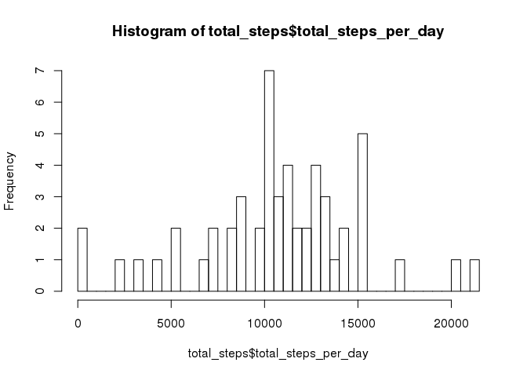
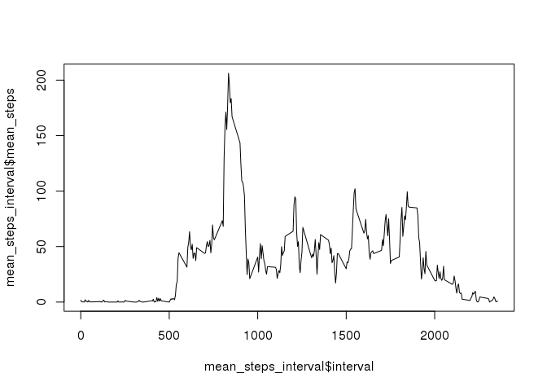

# Reproducible Research: Peer Assessment 1

## Loading libraries to help processing the data

```r
library(dplyr)
```

```
## 
## Attaching package: 'dplyr'
## 
## The following objects are masked from 'package:stats':
## 
##     filter, lag
## 
## The following objects are masked from 'package:base':
## 
##     intersect, setdiff, setequal, union
```

```r
library(ggplot2)
```

## Loading and preprocessing the data First check if the file activity.zip was
unzipped, if it was not, then unzip it.

```r
if (!file.exists('activity.csv')){
    unzip('activity.zip')
}
```
Then read the data, using the colClasses argument to set the Date field as Date.

```r
data <- read.table('activity.csv',
                    header=TRUE, sep=',',
                    colClasses=c('numeric','Date','numeric'))
```

## What is mean total number of steps taken per day?
First let's calculate the total number of steps taken per day, ignoring NA's.

```r
total_steps <- data %>%
    filter(!is.na(steps)) %>%
    group_by(date) %>%
    summarize(total_steps_per_day=sum(steps))
```

Plotting an histogram with the total number of steps.

```r
hist(total_steps$total_steps_per_day, breaks=50)
```

 

Calculating the mean of total number of setps taken per day

```r
mean(total_steps$total_steps_per_day)
```

```
## [1] 10766.19
```

Calculating the median of total number of setps taken per day

```r
median(total_steps$total_steps_per_day)
```

```
## [1] 10765
```

## What is the average daily activity pattern?
Plotting  the average number of steps taken for each five minutes

```r
mean_steps_interval <- data %>%
    select(interval, steps) %>%
    group_by(interval) %>%
    summarize(mean_steps=mean(steps,na.rm = TRUE))
plot(x=mean_steps_interval$interval, y=mean_steps_interval$mean_steps, type='l')
```

 

The 5-minute interval that has the maximum number of steps, on average across all days is:

```r
mean_steps_interval %>%
    filter(mean_steps==max(mean_steps)) %>%
    select(interval)
```

```
## Source: local data frame [1 x 1]
## 
##   interval
##      (dbl)
## 1      835
```

## Imputing missing values


## Are there differences in activity patterns between weekdays and weekends?
